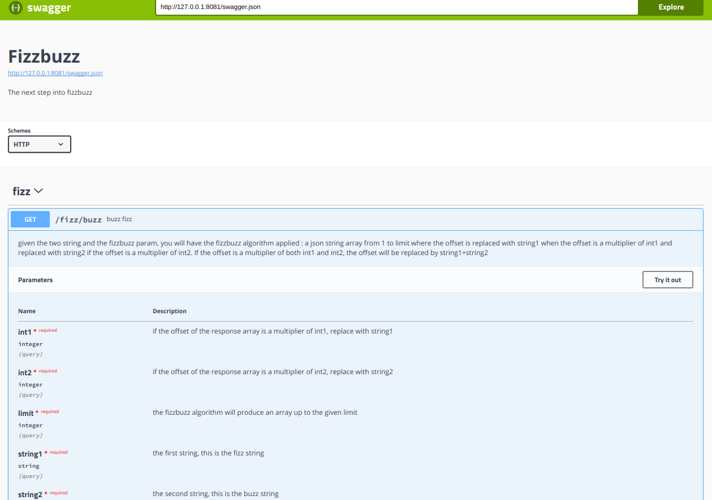

# FizzBuzz API EXAMPLE

This is an example of what you can do if you are asked of a fizzbuzz api. The goal of this design is to demonstrate 
best practices and knowledge.


### Prerequisite

As this api needs contexts, this projects needs **go 1.7** or greater.

### Compile and launch

To launch it you will need the golang compiler :

```
go build && ./fb 
```

By default the application will be launched on the port 8081.

Changing the port :

```
./fb -port 8082
```

General usage : 

```bash
Usage of ./fb:
  -pool string
    	server pool list (default "http://localhost:8080")
  -port string
    	port to start the api (default ":8081")
```

- **port** : if you want to change the port
- **pool** : if you have many server and want to share the cache

### Dependencies

Dependencies are vendored with glide (https://github.com/Masterminds/glide).
Everything works out of the box. If you want to update, please read the glide documentation.

#### Goa

The http REST  api is designed via goa (http://goa.design).

##### Why ?

Because it handles all the parameters validation and documentation part automatically via swagger spec generation.
If you need more performance you will probably seek for a custom method without any layer on top of the http package. (but will take more time)

#### Groupcache

The cache is groupcache, a shared across nodes cache developped by google : https://github.com/golang/groupcache

### The API

#### The classic fizzbuzz

```
GET /fizz/buzz
```

```bash
curl -vvv "http://localhost:8081/fizz/buzz?string1=fizz&string2=buzz&int1=3&int2=5&limit=20"
*   Trying 127.0.0.1...
* TCP_NODELAY set
* Connected to localhost (127.0.0.1) port 8081 (#0)
> GET /fizz/buzz?string1=fizz&string2=buzz&int1=3&int2=5&limit=20 HTTP/1.1
> Host: localhost:8081
> User-Agent: curl/7.52.1
> Accept: */*
> 
< HTTP/1.1 200 OK
< Content-Type: application/json
< Vary: Origin
< Date: Sun, 08 Oct 2017 14:31:55 GMT
< Content-Length: 119
< 
["1","2","fizz","4","buzz","fizz","7","8","fizz","buzz","11","fizz","13","14","fizzbuzz","16","17","fizz","19","buzz"]
* Curl_http_done: called premature == 0
* Connection #0 to host localhost left intact
```

#### The fizzbuzz in cache

As the result is deterministic, we can use a cache to speed up operations (64mb of cache per node)

```
GET /fizz/buzz_cache
```

```bash
time curl -vvv "http://localhost:8081/fizz/buzz_cache?string1=fizz&string2=buzz&int1=3&int2=5&limit=10000030" > /dev/null
  % Total    % Received % Xferd  Average Speed   Time    Time     Time  Current
                                 Dload  Upload   Total   Spent    Left  Speed
  0     0    0     0    0     0      0      0 --:--:-- --:--:-- --:--:--     0*   Trying 127.0.0.1...
* TCP_NODELAY set
* Connected to localhost (127.0.0.1) port 8081 (#0)
> GET /fizz/buzz_cache?string1=fizz&string2=buzz&int1=3&int2=5&limit=10000030 HTTP/1.1
> Host: localhost:8081
> User-Agent: curl/7.52.1
> Accept: */*
> 
< HTTP/1.1 200 OK
< Content-Type: application/json
< Vary: Origin
< Date: Sun, 08 Oct 2017 17:04:13 GMT
< Transfer-Encoding: chunked
< 
{ [3966 bytes data]
* Curl_http_done: called premature == 0
100 83.9M    0 83.9M    0     0   793M      0 --:--:-- --:--:-- --:--:--  799M
* Connection #0 to host localhost left intact
curl -vvv  > /dev/null  0,02s user 0,05s system 56% cpu 0,137 total
```

The fizzbuzz in cache uses google groupcache to cache data : the cache is shared across the nodes to keep results synced.
Declare the node with the **-pool** param.

#### The cache expiration

```
GET /fizz/expire_cache
```

```bash
curl -vvv "http://localhost:8081/fizz/expire_cache"
*   Trying 127.0.0.1...
* TCP_NODELAY set
* Connected to localhost (127.0.0.1) port 8081 (#0)
> GET /fizz/expire_cache HTTP/1.1
> Host: localhost:8081
> User-Agent: curl/7.52.1
> Accept: */*
> 
< HTTP/1.1 200 OK
< Content-Type: application/json
< Vary: Origin
< Date: Sun, 08 Oct 2017 17:02:45 GMT
< Content-Length: 0
< 
* Curl_http_done: called premature == 0
* Connection #0 to host localhost left intact

```

#### The swagger specs

```
/swagger.json
```

or 

```
/swagger.yaml
```


### The interactive documentation

To run the documentation engine:

```bash
docker run --rm -p 81:8080 -e API_URL=http://127.0.0.1:8081/swagger.json swaggerapi/swagger-ui
```

And open the browser on the given url : http://localhost:81



### Features

- Parameters validation (via goa/swagger)
- Swagger specifications and documentation automatically generated
- Fizzbuzz method tests (package fizzbuzz) + benchmarks
- Http handler test (package http goa)
- Logging (via logrus)
- graceful shutdown
- Keep-alive
- Timeout (for the server and the fizz buzz method via context)
- Vendored dependencies with glide
- Fizzbuzz method uses context to cancel it
- shared across nodes cache


### Design

#### Fizzbuzz part

The fizzbuzz part is located in the fizzbuzz package. You will find two implementation, unit test, benchmarks and example

#### Http

##### Server

The http server part is located in the main

##### Goa design

The goa layer is described in http/design package. By modifying design.go according to goa doc and doing :

```bash
goagen bootstrap -d github.com/mrsinham/fb/http/design -o http/goa
```

or simply 

```bash
go generate
```

(as the main.go file possess the //go:generate tag)

you will generate new validations and handlers rules, available in the package :

```
http/goa
```

##### Goa layer

Goa generates handlers in the http/goa package. After generating the skeleton it lefts the controllers untouched and you only need to fill them with code.


### Testing

```
 go test -v $(go list ./... | grep -v /vendor/)
```

### Cache for fizzbuzz ? Goa ? Swagger ? Overkill ?!

Sure, but it is a technical demonstration :) 